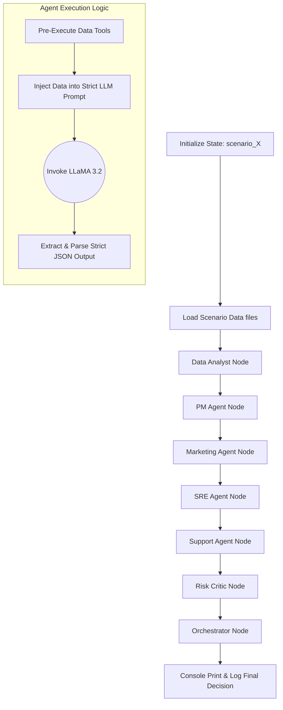

# Multi-Agent Product Launch War Room Simulation

This system is a production-grade multi-agent architecture built with LangGraph and local LLaMA 3.2 (via Ollama). It simulates a cross-functional war room by engaging distinct roles (Data Analyst, PM, Marketing, SRE, Customer Support, and Risk Critic) to analyze dataset scenarios and synthesize a deterministic, rule-based product launch decision (PROCEED, PAUSE, or ROLLBACK).

## Setup Instructions

1. **Install Dependencies**
   Ensure you have Python 3.9+ installed. Set up your virtual environment and install requirements:
   ```bash
   python -m venv venv
   source venv/bin/activate  # On Windows use: venv\Scripts\activate
   pip install langgraph langchain ollama pandas requests python-dotenv
   ```

2. **Install Local LLM (Ollama)**
   The orchestration system has been specifically engineered to utilize local inference safely:
   - Install [Ollama](https://ollama.com/).
   - Pull the requested LLaMA 3.2 model:
     ```bash
     ollama run llama3.2
     ```
     or
     ```bash
     ollama pull llama3.2
     ```
   - Ensure Ollama is running natively. The system validates availability at `http://localhost:11434/api/tags`.

3. **Environment Setup**
   Create or adjust your `.env` file at the root. Since API fallbacks were removed to enforce reliable, cost-free deterministic local execution:
   ```env
   LLM_MODE=local
   ```
   - if you want to use llm, modify some variables in `.env` file and code files.Your system will be able to use llm.

## How to Run End-to-End

The system relies on dynamically parsing isolated scenario datasets. Verify the `data/` directory structure exists and contains metrics, feedback, and release notes separated correctly:

```text
data/
  ├─ scenario_1/
  │    ├─ metrics.json
  │    ├─ feedback.json
  │    └─ release_notes.json
  ├─ scenario_2/
  │    ├─ ...
```

Run the `main.py` entry point mapped to the scenario you wish to pipeline. The orchestrator will fetch the localized structures, route logic through the six distinct agents interactively, and synthesize the collective `STATE` validation into the standard output.

## Example Commands

Execute the scenario context directly via standard CLI parameters. If no argument is passed, execution defaults to `scenario_1`.

**Run default scenario:**
```bash
python main.py
```

**Run explicit dynamic scenarios:**
```bash
python main.py scenario_1
python main.py scenario_2
python main.py scenario_3
```

Check the `logs/system_trace.log` file for extensive telemetry, node-by-node IO mapping, and metric diagnosis outputs.

---

## Sample Data Scenarios

The system dynamically processes isolated scenarios found in the `data/` folder, each specifically engineered to trigger distinct orchestrator evaluations:

- **`scenario_1` (ROLLBACK):** Contains severe latency spikes, failing payments, and highly negative feedback explicitly forcing systems to safely abort and prevent downstream cascade.
- **`scenario_2` (PAUSE):** Contains elevated but not terminal risk parameters paired with mixed sentiment, signaling the system to pause, enter triage mode, and halt the rollout for manual debugging.
- **`scenario_3` (PROCEED):** Features stable telemetries, highly positive sentiment interactions, and optimal latency patterns safely prompting the LangGraph path to continue operations.

---

## Architecture & Technology Stack

**Tech Stack:**
- **Orchestration Engine:** LangGraph (Python)
- **Local Inference LLM:** Ollama (LLaMA 3.2 model)
- **Data Computation:** Pandas, python-dotenv
- **Interoperability:** JSON mapping utilities

### System Architecture Diagram
```mermaid
graph TD
    Data[data/scenario_*] --> DataLoader[Scenario Initializer]
    DataLoader --> LangGraph[LangGraph State Workflow]
    
    subgraph Autonomous War Room Agents
        DA[Data Analyst]
        PM[PM Agent]
        MKT[Marketing]
        SRE[SRE]
        CS[Custom Support]
        RISK[Risk Critic]
    end
    
    LangGraph -.-> DA
    DA -.-> PM
    PM -.-> MKT
    MKT -.-> SRE
    SRE -.-> CS
    CS -.-> RISK
    RISK -.-> OrchestratorEngine[Synthesizer Node]
    
    OrchestratorEngine -.Finalize.-> Decision[Launch Decision: PROCEED/PAUSE/ROLLBACK]
    
    LocalLLM(Ollama: LLaMA 3.2) --> Autonomous War Room Agents
```

### System Workflow



### Orchestrator Logic & Control

The orchestrator guarantees deterministic synthesis by abandoning LLM generation in the final decision step. It relies entirely on Python-based constraint rules processed from the consolidated LangGraph state:
- **Priority Priority Thresholds:** Evaluates `Risk Score` first, falling back to `Target PM Recommendation` and `Negative Sentiment Volume`.
- **ROLLBACK Triggers:** Immediately fires if composite risk scores exceed 0.9 and negative feedback dominates user bases (> 70%).
- **PAUSE Triggers:** Fired if signals are dangerously mixed (Risk between 0.5 and 0.9), blocking the launch for engineering triage.
- **PROCEED Constraints:** Only authorized when all isolated variables successfully resolve as highly stable and optimal (Risk < 0.5, Low Negative Sentiment).
- **Graceful Fallbacks:** If node anomalies or partial agent failures occur, it defaults to a `PAUSE` state and rigorously propagates generated diagnostic outputs to avoid null values at runtime.